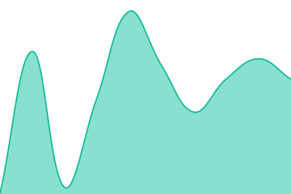
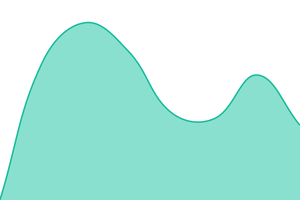
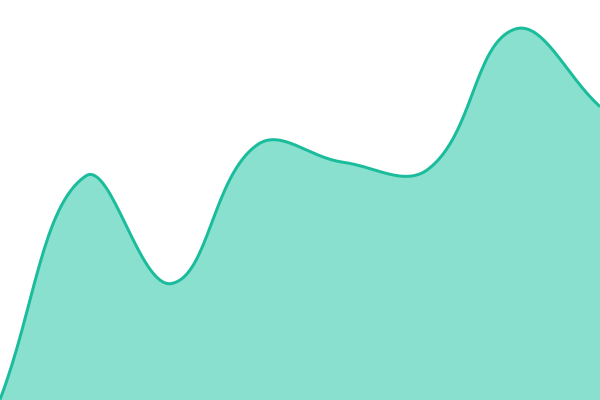
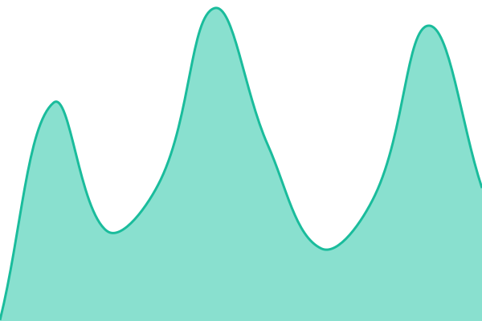

# [📈 Live Status](https://youkovo.github.io/upptime): <!--live status--> **🟧 Partial outage**

This repository contains the open-source uptime monitor and status page for [youkovo](https://youkovo.github.io/upptime), powered by [Upptime](https://github.com/upptime/upptime).

With [Upptime](https://upptime.js.org), you can get your own unlimited and free uptime monitor and status page, powered entirely by a GitHub repository. We use [Issues](https://github.com/youkovo/upptime/issues) as incident reports, [Actions](https://github.com/youkovo/upptime/actions) as uptime monitors, and [Pages](https://youkovo.github.io/upptime) for the status page.

<!--start: status pages-->
<!-- This summary is generated by Upptime (https://github.com/upptime/upptime) -->
<!-- Do not edit this manually, your changes will be overwritten -->
<!-- prettier-ignore -->
| URL | Status | History | Response Time | Uptime |
| --- | ------ | ------- | ------------- | ------ |
|  [zero trust](https://one.akameow.com/generate_204) | 🟩 Up | [zero-trust.yml](https://github.com/youkovo/upptime/commits/HEAD/history/zero-trust.yml) | 

 510ms
     
 | 

<a href="https://youkovo.github.io/upptime/history/zero-trust">99.42%</a>
    

|  [static](https://one.akameow.com/static) | 🟥 Down | [static.yml](https://github.com/youkovo/upptime/commits/HEAD/history/static.yml) | 

 2949ms
     
 | 

<a href="https://youkovo.github.io/upptime/history/static">95.57%</a>
    

|  [sync](https://sync.akameow.com/) | 🟩 Up | [sync.yml](https://github.com/youkovo/upptime/commits/HEAD/history/sync.yml) | 

 590ms
     
 | 

<a href="https://youkovo.github.io/upptime/history/sync">100.00%</a>
    

|  [searxng](https://search.akameow.com/) | 🟩 Up | [searxng.yml](https://github.com/youkovo/upptime/commits/HEAD/history/searxng.yml) | 

 235ms
     
 | 

<a href="https://youkovo.github.io/upptime/history/searxng">99.20%</a>
    

<!--end: status pages-->

[**Visit our status website →**](https://youkovo.github.io/upptime)

## 📄 License

- Powered by: [Upptime](https://github.com/upptime/upptime)
- Code: [MIT](./LICENSE) © [Anand Chowdhary](https://anandchowdhary.com)
- Data in the `./history` directory: [Open Database License](https://opendatacommons.org/licenses/odbl/1-0/)
